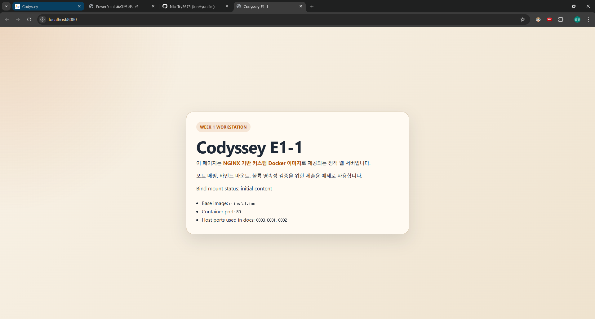
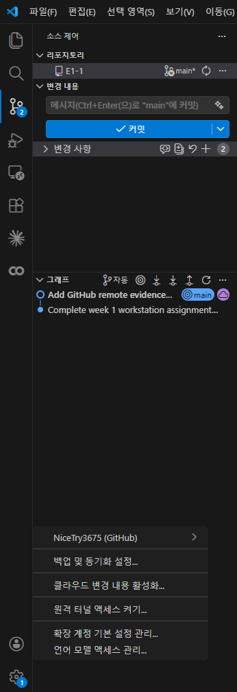

# AI/SW 개발 워크스테이션 구축

`Requirements.md`의 첫 주차 필수 요구사항을 기준으로 CLI 실습, Docker 기본 운영, Dockerfile 기반 커스텀 이미지, 포트 매핑, 바인드 마운트, 볼륨 영속성, Git/GitHub 연동을 한 저장소에 정리했다.

## 1. 프로젝트 개요

- 목표: 터미널 중심으로 개발 워크스테이션을 구축하고, Docker 컨테이너를 직접 다뤄 보며 재현 가능한 실행 환경을 만든다.
- 선택한 구현 방식: `nginx:alpine` 기반 커스텀 이미지 + 정적 HTML 페이지
- 제출 기준: README만 읽어도 수행 절차, 검증 방법, 결과 위치를 확인할 수 있어야 한다.
- GitHub 저장소: `https://github.com/NiceTry3675/E1-1`

## 2. 실행 환경

- OS: Ubuntu 24.04.3 LTS on WSL2
- Shell: bash
- Terminal: Codex bash session
- Docker: 28.3.0 (Docker Desktop / `desktop-linux` context)
- Git: 2.43.0
- VS Code: 1.112.0

전체 로그: [environment.txt](docs/logs/environment.txt)

```text
+ uname -a
Linux localhost 6.6.87.2-microsoft-standard-WSL2 ...
+ git --version
git version 2.43.0
+ code --version
1.112.0
```

## 3. 수행 체크리스트

- [x] 터미널 기본 조작 및 파일/디렉터리 생성
- [x] 파일 1개, 디렉터리 1개 권한 변경 실습
- [x] Docker 설치/동작 점검
- [x] `hello-world` 실행
- [x] `ubuntu` 컨테이너 내부 명령 실행
- [x] `Dockerfile` 기반 커스텀 이미지 빌드
- [x] 포트 매핑 접속 확인 (`8080`, `8081`)
- [x] 바인드 마운트 변경 반영 확인 (`8082`)
- [x] named volume 영속성 확인
- [x] Git 사용자 정보 / 기본 브랜치 설정
- [x] GitHub CLI 로그인 상태 확인

## 4. 결과 위치와 검증 방법

- 환경 정보: [environment.txt](docs/logs/environment.txt)
- 터미널 기본 조작 / 권한: [cli-session.txt](docs/logs/cli-session.txt)
- Docker 설치 점검 / 기본 운영 / `hello-world` / `ubuntu`: [docker-basics.txt](docs/logs/docker-basics.txt)
- Dockerfile 빌드 / 포트 매핑 / 웹 로그: [custom-image.txt](docs/logs/custom-image.txt)
- 바인드 마운트: [bind-mount.txt](docs/logs/bind-mount.txt)
- 볼륨 영속성: [volume.txt](docs/logs/volume.txt)
- Git 설정: [git-config.txt](docs/logs/git-config.txt)
- GitHub 인증 상태: [github-auth.txt](docs/logs/github-auth.txt)
- GitHub 원격 생성 / push: [github-remote.txt](docs/logs/github-remote.txt)

## 5. 터미널 조작 로그

실습 경로는 `practice/cli-lab`이다. 절대 경로는 `/home/tomto/projects/codyssey/E1-1/practice/cli-lab`처럼 루트(`/`)부터 시작하는 경로이고, 상대 경로는 현재 위치를 기준으로 한 `practice/cli-lab`, `move-me/renamed.txt` 같은 경로다.

전체 로그: [cli-session.txt](docs/logs/cli-session.txt)

```text
+ pwd
/home/tomto/projects/codyssey/E1-1/practice/cli-lab
+ ls -la
total 8
drwxr-xr-x 2 tomto tomto 4096 ...
+ cat notes.txt
hello cli
+ mv notes-copy.txt renamed.txt
+ mv renamed.txt move-me/renamed.txt
+ rm -f empty.txt
```

## 6. 권한 실습

파일 권한은 `rwx`를 소유자/그룹/기타 사용자에 대해 숫자로 압축한 표기다. `644`는 `rw-r--r--`, `755`는 `rwxr-xr-x`를 뜻한다.

전체 로그: [cli-session.txt](docs/logs/cli-session.txt)

```text
+ ls -ld perm-file.txt perm-dir
drwxr-xr-x ... perm-dir
-rw-r--r-- ... perm-file.txt
+ chmod 600 perm-file.txt
+ chmod 700 perm-dir
+ ls -ld perm-file.txt perm-dir
drwx------ ... perm-dir
-rw------- ... perm-file.txt
+ chmod 644 perm-file.txt
+ chmod 755 perm-dir
```

## 7. Docker 설치 및 기본 점검

Docker Desktop이 실행된 뒤 `desktop-linux` context에서 동작하는 것을 확인했다.

전체 로그: [docker-basics.txt](docs/logs/docker-basics.txt)

```text
+ docker --version
Docker version 28.3.0, build 38b7060
+ docker.exe context ls
default
desktop-linux *
+ docker.exe info
Server Version: 28.3.0
Operating System: Docker Desktop
OSType: linux
```

## 8. Docker 기본 운영 명령

이미지 목록, 컨테이너 목록, 로그, 리소스 사용량을 확인했고, 별도 테스트 컨테이너에 대해 `docker stop`도 수행했다.

전체 로그: [docker-basics.txt](docs/logs/docker-basics.txt)

```text
+ docker.exe images
hello-world
ubuntu
+ docker.exe ps -a
week1-hello   Exited (0)
+ docker.exe logs week1-hello
Hello from Docker!
+ docker.exe stats --no-stream ubuntu-lab
ubuntu-lab   0.00%   952KiB / 7.712GiB
+ docker.exe stop ubuntu-stop-demo
ubuntu-stop-demo
+ docker.exe ps -a --filter name=ubuntu-stop-demo
ubuntu-stop-demo   Exited (137)
```

## 9. 컨테이너 실행 실습

`hello-world`로 설치 확인을 마쳤고, `ubuntu-lab` 컨테이너 안에서 실제 명령을 실행했다.

전체 로그: [docker-basics.txt](docs/logs/docker-basics.txt)

```text
+ docker.exe run --name week1-hello hello-world
Hello from Docker!
+
+ docker.exe run -dit --name ubuntu-lab ubuntu bash
+ docker.exe exec ubuntu-lab bash -lc 'ls / && echo hello-from-container'
bin
boot
...
hello-from-container
```

`attach`와 `exec` 차이 정리:

- `attach`는 컨테이너의 메인 프로세스 표준 입출력에 직접 붙는다.
- `exec`는 이미 실행 중인 컨테이너 안에 별도 프로세스를 추가 실행한다.
- 이번 과제에서는 메인 `bash`를 유지한 채 실험해야 했기 때문에 관찰과 기록에는 `exec`가 더 안전했다.

## 10. Dockerfile 기반 커스텀 이미지

선택한 베이스 이미지는 `nginx:alpine`이다.

- 선택 이유: 포트 매핑과 브라우저/`curl` 검증이 단순하다.
- 커스텀 포인트 1: 제출용 정적 페이지를 `site/`에서 복사
- 커스텀 포인트 2: 기본 NGINX 페이지 대신 과제 식별 문구 노출

관련 파일:

- [Dockerfile](Dockerfile)
- [site/index.html](site/index.html)
- 전체 로그: [custom-image.txt](docs/logs/custom-image.txt)

```dockerfile
FROM nginx:alpine
LABEL org.opencontainers.image.title="codyssey-week1-workstation"
COPY site/ /usr/share/nginx/html/
```

## 11. 포트 매핑 및 접속 증거

동일 이미지를 두 번 실행해 `8080`, `8081` 포트로 각각 접근 가능한 것을 확인했다. 이것으로 이미지와 컨테이너가 분리되어 있고, 같은 이미지에서 여러 컨테이너를 반복 실행할 수 있음을 확인했다.

전체 로그: [custom-image.txt](docs/logs/custom-image.txt)

브라우저 스크린샷:



```text
+ docker.exe run -d --name week1-web-8080 -p 8080:80 workstation-nginx:1.0
+ docker.exe run -d --name week1-web-8081 -p 8081:80 workstation-nginx:1.0
+ curl -s http://localhost:8080 | rg 'Codyssey E1-1|Bind mount status'
<title>Codyssey E1-1</title>
<p id="bind-marker">Bind mount status: initial content</p>
+ curl -s http://localhost:8081 | rg 'Codyssey E1-1|Bind mount status'
<title>Codyssey E1-1</title>
<p id="bind-marker">Bind mount status: initial content</p>
```

## 12. 바인드 마운트 반영

호스트의 `practice/bind-proof/` 디렉터리를 NGINX 컨테이너에 읽기 전용으로 마운트하고, 호스트 파일 내용을 직접 바꾼 뒤 컨테이너를 재생성하지 않고 응답이 바뀌는지 확인했다.

전체 로그: [bind-mount.txt](docs/logs/bind-mount.txt)

```text
+ printf '%s\n' '<!doctype html>' '<html><body><p id="bind-marker">Bind mount status: before host edit</p></body></html>' > practice/bind-proof/index.html
+ cat practice/bind-proof/index.html
<!doctype html>
<html><body><p id="bind-marker">Bind mount status: before host edit</p></body></html>
+ docker.exe run -d --name week1-bind-proof -p 8083:80 -v '\\wsl.localhost\Ubuntu\home\tomto\projects\codyssey\E1-1\practice\bind-proof:/usr/share/nginx/html:ro' nginx:alpine
+ curl -s http://localhost:8083 | rg 'Bind mount status'
<html><body><p id="bind-marker">Bind mount status: before host edit</p></body></html>
+ printf '%s\n' '<!doctype html>' '<html><body><p id="bind-marker">Bind mount status: after host edit</p></body></html>' > practice/bind-proof/index.html
+ cat practice/bind-proof/index.html
<!doctype html>
<html><body><p id="bind-marker">Bind mount status: after host edit</p></body></html>
+ curl -s http://localhost:8083 | rg 'Bind mount status'
<html><body><p id="bind-marker">Bind mount status: after host edit</p></body></html>
```

정리:

- 바인드 마운트는 호스트 파일 변경이 컨테이너에 즉시 반영되는지 확인하는 데 적합하다.
- 소스 반영 확인이 목적일 때는 이미지 재빌드보다 빠르다.

## 13. Docker 볼륨 영속성 검증

named volume `week1-data`를 만들고, 컨테이너 삭제 전후로 같은 파일이 유지되는지 확인했다.

전체 로그: [volume.txt](docs/logs/volume.txt)

```text
+ docker.exe volume create week1-data
week1-data
+ docker.exe exec week1-volume bash -lc 'echo persisted-from-volume > /data/hello.txt && cat /data/hello.txt'
persisted-from-volume
+ docker.exe rm -f week1-volume
+ docker.exe exec week1-volume-2 bash -lc 'cat /data/hello.txt'
persisted-from-volume
```

정리:

- 바인드 마운트는 호스트 디렉터리와 연결된다.
- 볼륨은 Docker가 관리하는 저장소라서 컨테이너를 지워도 데이터가 남는다.

## 14. Git 설정 및 GitHub 연동

기본 브랜치를 `main`으로 설정했고, `git config --list`와 `gh auth status`를 명령어 포함 로그로 기록했다. 토큰과 이메일은 마스킹했다.

전체 로그:

- [git-config.txt](docs/logs/git-config.txt)
- [github-auth.txt](docs/logs/github-auth.txt)
- [github-remote.txt](docs/logs/github-remote.txt)

VS Code 연동 스크린샷:



```text
git config --list
user.name=NiceTry3675
user.email=to***@hs.ac.kr
init.defaultbranch=main
```

```text
gh auth status
Logged in to github.com account NiceTry3675
Git operations protocol: https
Token: gho_************************************
```

```text
gh repo create E1-1 --public --source=. --remote=origin --push
https://github.com/NiceTry3675/E1-1
origin  https://github.com/NiceTry3675/E1-1.git (fetch)
origin  https://github.com/NiceTry3675/E1-1.git (push)
```

참고:

- 본 저장소는 CLI 로그와 VS Code 스크린샷을 함께 남겼다.

## 15. 트러블슈팅

### 1) WSL 셸에서 `docker`가 처음에는 잡히지 않음

- 문제: 초기 확인 시 WSL 셸에서 `docker` 명령이 없다는 메시지가 나왔다.
- 원인 가설: Docker Desktop 앱이 실행되지 않았거나 WSL 쪽 통합이 아직 연결되지 않았다.
- 확인: `docker.exe info`도 처음에는 `dockerDesktopLinuxEngine` 파이프를 찾지 못했다.
- 해결: Windows의 Docker Desktop을 실행한 뒤 다시 점검했고, 이후 `docker --version`, `docker.exe info`가 정상 동작했다.

### 2) 바인드 마운트 경로가 잘못되어 컨테이너 실행 실패

- 문제: 첫 바인드 마운트 시 `is not a valid Windows path` 오류가 발생했다.
- 원인 가설: `wslpath -w`로 만든 경로를 감싸는 quoting이 잘못되어 경로 앞뒤에 불필요한 문자가 붙었다.
- 확인: [bind-mount.txt](docs/logs/bind-mount.txt) 첫 부분에 깨진 경로와 오류 메시지가 기록됐다.
- 해결: `wslpath -w "$(pwd)/site"` 형식으로 경로를 다시 만들고 `\\wsl.localhost\Ubuntu\...` 형식으로 전달해 성공했다.

### 3) Git 기본 브랜치가 명시돼 있지 않음

- 문제: 전역 설정에 `init.defaultbranch`가 없었다.
- 원인 가설: Git 설치 후 기본 브랜치 설정을 따로 하지 않았다.
- 확인: `git config --global init.defaultBranch`가 빈 값이었다.
- 해결: `git config --global init.defaultBranch main`으로 고정하고 저장소를 `main` 브랜치로 초기화했다.

## 16. 보안 및 개인정보 보호

- README와 로그에는 토큰 전체 값을 남기지 않았다.
- Git 이메일은 마스킹했다.
- 비밀번호, 개인키, OTP 코드는 저장하지 않았다.
- GUI 스크린샷을 추가할 경우에도 주소창과 결과만 남기고 민감정보는 가린다.
